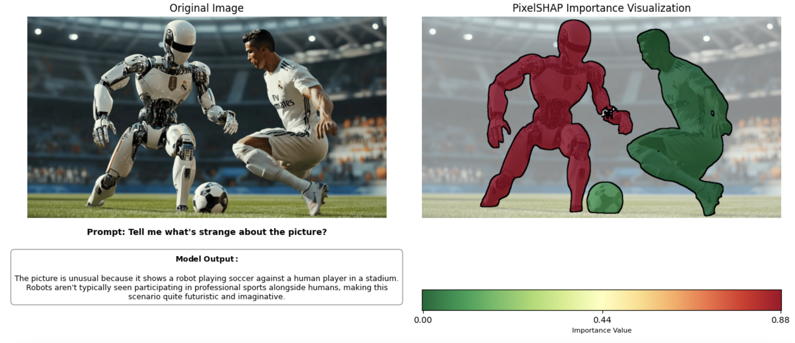
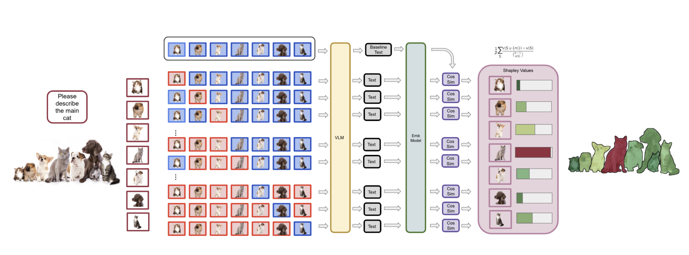

# TokenSHAP & PixelSHAP: Interpreting Large Language and Vision-Language Models

TokenSHAP and PixelSHAP are two complementary model-agnostic interpretability frameworks for large-scale AI systems. Both methods are grounded in Monte Carlo Shapley value estimation, enabling detailed attribution of importance to individual parts of the input—whether they are **tokens in text** or **objects in images**.

## Overview

- **TokenSHAP** explains the output of large language models (LLMs) by computing Shapley values for input tokens. It estimates how much each token contributes to the final model response.

- **PixelSHAP** extends this idea to vision-language models (VLMs), attributing importance to segmented **visual objects** in an image, showing which objects influenced the textual output.

These tools are essential for understanding the decision-making process of LLMs and VLMs, especially in high-stakes applications such as autonomous driving, healthcare, and legal AI.

---

## 🔍 TokenSHAP

TokenSHAP provides fine-grained interpretability for language models using Monte Carlo Shapley value estimation over input tokens.


### Key Features
- Estimates token importance using cooperative game theory
- Highlights which parts of a prompt contributed most to the generated response
- Compatible with both local and API-based LLMs

### Example Usage
```python
from token_shap import *

model = LocalModel("meta-llama/Llama-3.2-3B-Instruct")
splitter = StringSplitter()
token_shap = TokenSHAP(model, splitter)

prompt = "Why is the sky blue?"
df = token_shap.analyze(prompt, sampling_ratio=0.0, print_highlight_text=True)
```

For API-based models:
```python
api_model = OllamaModel(model_name="llama3.2:3b", api_url="http://localhost:11434")
token_shap_api = TokenSHAP(api_model, StringSplitter())
df = token_shap_api.analyze("Why is the sky blue?", sampling_ratio=0.0)
```


---

## 🖼️ PixelSHAP

PixelSHAP is an object-level interpretability framework for **text-generating vision-language models**. It attributes Shapley values to visual objects based on their contribution to the model's response.




### What Makes PixelSHAP Unique?
- **Model-agnostic**: Only requires input-output access (no internal model introspection needed)
- **Object-level attribution**: Uses segmentation models like SAM + Grounding DINO
- **Efficient**: Avoids pixel-level perturbations by masking full objects
- **Supports any black-box VLM**: Works with commercial models like GPT-4o and open-source models like LLaVA

### Architecture



### Example Usage
```python
pixel_shap = PixelSHAP(
    model=vlm,
    segmentation_model=segmentation_model,
    manipulator=manipulator,
    vectorizer=openai_embedding,
    debug=False,
    temp_dir='example_temp',
)

results_df, shapley_values = pixel_shap.analyze(
    image_path=image_path,
    prompt="Tell me what's strange about the picture?",
    sampling_ratio=0.5,
    max_combinations=20,
    cleanup_temp_files=True
)

pixel_shap.visualize(
    background_opacity=0.5,
    show_original_side_by_side=True,
    show_labels=False,
    show_model_output=True
)
```

---

## 🧪 Installation

To get started, clone the repository and install the dependencies:

```bash
git clone https://github.com/ronigold/TokenSHAP.git
cd TokenSHAP
pip install -r requirements.txt
```

*Note: PyPI installation is currently disabled.*

---

## 📄 Citation

If you use TokenSHAP or PixelSHAP in your research, please cite:

```bibtex
@article{goldshmidt2024tokenshap,
  title={TokenSHAP: Interpreting Large Language Models with Monte Carlo Shapley Value Estimation},
  author={Goldshmidt, Roni and Horovicz, Miriam},
  journal={arXiv preprint arXiv:2407.10114},
  year={2024}
}

@article{goldshmidt2025pixelshap,
  title={Attention, Please! PixelSHAP Reveals What Vision-Language Models Actually Focus On},
  author={Goldshmidt, Roni},
  journal={arXiv preprint arXiv:2503.06670},
  year={2025}
}
```

---

## 👥 Authors

- **Roni Goldshmidt**, Nexar
- **Miriam Horovicz**, NI

For questions or support, contact:
- roni.goldshmidt@getnexar.com
- miriam.horovicz@ni.com

---

## 🔧 Contributing

We welcome community contributions! To contribute:
1. Fork the repository
2. Create a branch: `git checkout -b feature/your-feature`
3. Commit your changes: `git commit -am 'Add feature'`
4. Push the branch: `git push origin feature/your-feature`
5. Open a Pull Request

---

## 📂 Repository Structure

- `token_shap/` — Token-level attribution logic
- `pixel_shap/` — Object-level attribution for VLMs
- `notebooks/` — Jupyter notebooks with examples
- `data/` — Images used in the documentation

---

By combining TokenSHAP and PixelSHAP, this library offers full-spectrum interpretability for modern AI systems, from language-only prompts to complex multimodal inputs.
